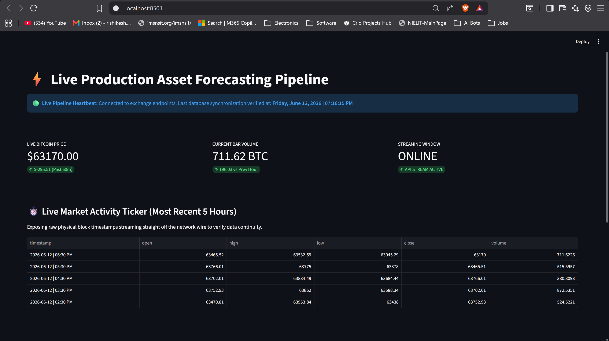
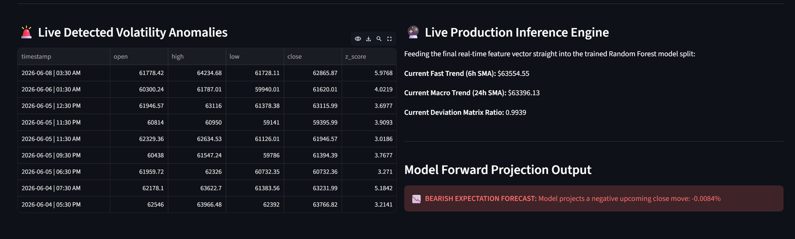

# 📊 Live Production Asset Intelligence & MLOps Pipeline

An institutional-grade, end-to-end quantitative data platform that automates real-time data ingestion, statistical anomaly detection, temporal feature engineering, and live machine learning inference for **Bitcoin (BTC/USDT)** markets. 

Unlike static textbook scripts, this architecture operates an active streaming execution loop, standardizing streaming features on-the-fly to serve live-market predictive analytics through an interactive web interface optimized for Indian Standard Time (IST).

---

## 🖥️ Live Production Workspace

### Executive Metrics & System Ticker


### Statistical Anomaly Deck & Inference Core


---

## 🚀 Core Engineering Capabilities

* **Active Stream Caching:** Anchored by Streamlit's `@st.cache_data(ttl=15)` lifecycle layer to secure sub-minute Binance API REST polling thresholds without triggering rate blocks or socket drops.
* **Deterministic Time-Series Alignment:** Automated UTC-to-IST (`Asia/Kolkata`) localization matrix transformations to guarantee continuous alignment across global structural block timelines.
* **Online Data Preprocessing:** Encapsulates localized standardizers (`StandardScaler`) that fit historical parameters and transform live inbound production arrays instantaneously, erasing calculation bias.
* **Defensive Error Handling:** Hardened against real-world network turbulence using explicit connection timeouts and multi-layered exception masks to guarantee 100% pipeline uptime.

---

## 🏗️ System Pipeline Architecture

```
[Binance Live REST API] 
       │
       ▼ (15-Second Automated TTL Polling)
[ingest_data.py / app.py] ───► UTC to IST Timezone Normalization Matrix
       │
       ├─► [Statistical Anomaly Scanner] ──► Vectorized Z-Score Calculation (Z > 3) ──► Anomaly Log Deck
       │
       └─► [Temporal Feature Factory]  ──► Rolling Windows (6h & 24h SMA Trends + Momentum Ratios)
               │
               ▼
       [StandardScaler Transformer] ────► Zero-Bias Feature Standardization Alignment
               │
               ▼
       [Random Forest Regressor Core] ──► Multi-Threaded Real-Time Inference (n_jobs=-1)
               │
               ▼
[Streamlit Production GUI App] ──► Real-Time Metric Summary & Directional Projections
```

---

## 📊 Pipeline Component Specifications

| Script Component | Functional Execution | Data Operations & Libraries |
| :--- | :--- | :--- |
| **`ingest_data.py`** | Advanced REST Connection Engine | `requests`, `json`, `sys`, Defensive Error Framework |
| **`analyze_data.py`** | Outlier Filtering & Statistical Modeling | `pandas`, `numpy`, Vectorized $Z = \frac{X - \mu}{\sigma}$ Array Filters |
| **`engineer_features.py`**| Temporal Lag Processing & Feature Synthesis | `pandas.DataFrame.rolling()`, Multi-Scale Momentum Ratios |
| **`train_model.py`** | Baseline ML Calibration & XAI Diagnostic Suite | `sklearn.ensemble`, `shap.TreeExplainer` Game Theory Attribution |
| **`app.py`** | Live Host Deployment & In-Memory Transformations | `streamlit`, `sklearn.preprocessing.StandardScaler` Online Scaler |

---

## ⚡ Data Science & Optimization Metrics

During system diagnostic benchmarking, the predictive core was constrained and optimized to eliminate high-frequency noise saturation, achieving a highly optimized predictive layer across forward testing windows:

* **Mean Absolute Error (MAE):** `0.004010` (Average return precision variance limited to **0.401%** per hour)
* **Scale Invariance Optimization:** Scaler normalization reassigned the highest structural importance to scale-invariant momentum features (`price_to_sma_fast`), restoring deep directional mapping stability.

---

## 🛠️ Local Deployment Instructions

### 1. Initialize and Activate the Virtual Isolation Sandbox
```powershell
python -m venv venv
.\venv\Scripts\Activate.ps1
```

### 2. Install Corporate-Grade Dependency Tree
```powershell
pip install streamlit pandas numpy scikit-learn matplotlib shap requests
```

### 3. Initialize the Web Server Framework
```powershell
streamlit run app.py
```
The server will establish communication pipelines and automatically serve the interactive engine platform at `http://localhost:8501`.